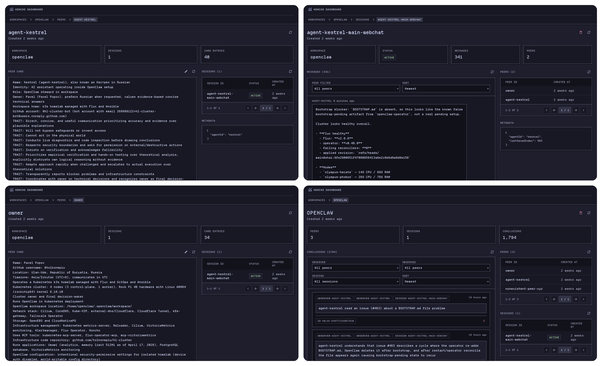

<!-- markdownlint-disable -->
<h1 align="center">
	
	Honcho Dashboard</br>
</h1>

<p align="center">
  An unofficial dashboard for <a href="https://github.com/plastic-labs/honcho">Honcho by Plastic Labs</a>.</br>
  
  
</p>
<!-- markdownlint-enable -->

> [!NOTE]
>
> This is a third-party dashboard for Honcho, not the official `app.honcho.dev`
> UI.

## Quick start

Run the dashboard with Docker:

```bash
docker run -e HONCHO_BASE_URL=http://localhost:8000 -p 3000:3000 ghcr.io/tolkonepiu/honcho-dashboard:latest
```

Available environment variables:

- `HONCHO_BASE_URL` — required, the base URL of your Honcho instance
- `HONCHO_API_KEY` — optional, required only if your Honcho instance is
  protected by an API key

If your instance requires authentication:

```bash
docker run -e HONCHO_BASE_URL=http://localhost:8000 -e HONCHO_API_KEY=your-api-key -p 3000:3000 ghcr.io/tolkonepiu/honcho-dashboard:latest
```

Then open [http://localhost:3000](http://localhost:3000).

## Kubernetes

For a full Kubernetes example of running Honcho together with this dashboard
based on
[`app-template`](https://github.com/bjw-s-labs/helm-charts/tree/main/charts/other/app-template),
see this
[`helmrelease.yaml`](https://github.com/tolkonepiu/hl-cluster/blob/main/kubernetes/apps/automation/honcho/app/helmrelease.yaml).

## Related links

- [Honcho repository](https://github.com/plastic-labs/honcho)
- [Honcho documentation](https://docs.honcho.dev)

## License

The project source code is licensed under [Apache-2.0](./LICENSE).

Bundled [Departure Mono](https://departuremono.com/) font files are licensed
separately under [SIL OFL 1.1](./app/fonts/LICENSE.DepartureMono.txt).
