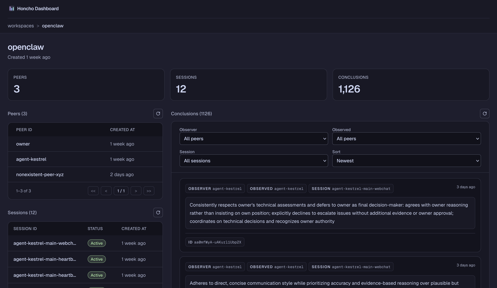

# Honcho Dashboard

An unofficial dashboard for
[Honcho by Plastic Labs](https://github.com/plastic-labs/honcho).

This project provides a lightweight web UI for exploring data in a Honcho
instance: workspaces, peers, sessions, messages, and conclusions.



> [!NOTE]
>
> This is a third-party dashboard for Honcho, not the official `app.honcho.dev`
> UI.

## Getting started

Install dependencies:

```bash
npm install
```

Set the environment variables before starting the app:

- `HONCHO_BASE_URL` — required, the base URL of your Honcho instance
- `HONCHO_API_KEY` — optional, required only if your Honcho instance is
  protected by an API key

Example:

```bash
HONCHO_BASE_URL=http://your-honcho-instance-url npm run dev
```

If your instance requires authentication:

```bash
HONCHO_BASE_URL=http://your-honcho-instance-url HONCHO_API_KEY=your-api-key npm run dev
```

Then open [http://localhost:3000](http://localhost:3000).

## Related links

- [Honcho repository](https://github.com/plastic-labs/honcho)
- [Honcho documentation](https://docs.honcho.dev)
